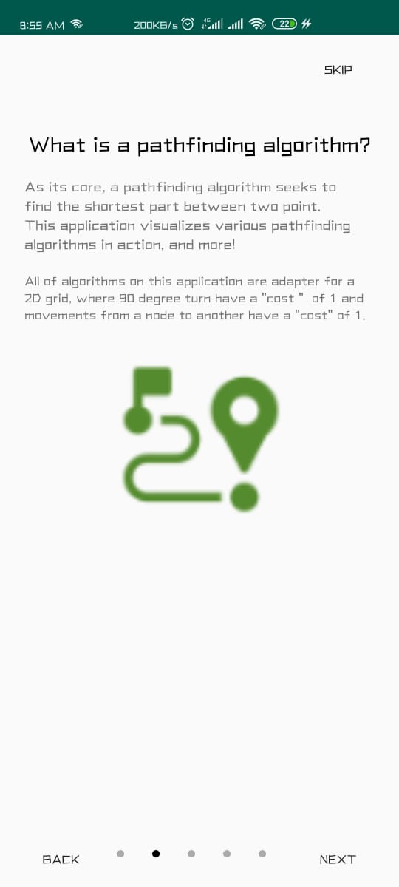
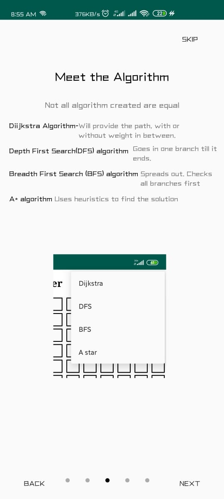

# Pathfinding-visualiser :eye_speech_bubble:
:smile: Welcome to Pathfinding-visualiser android app to visualize path-finding algorithms!! </br>

----

## Sneak Peak towards our creation:

<kbd>   </kbd>

----

## All about Pathfinding-visualiser
- It helps in finding the shortest path from source to destination.
- A Tutorial Sheet has been attached at the beginning for basic understanding.
- It works on various pathfinding algorithms like DFS, BFS, DIJIKSTRA, ASTAR.
- The Dijikstra algorithm also uses Weights which user can apply between the path.
- User can test the model by visualising all the algorithms working all together in a single application.
- It will help in better understanding of Graph Datastructure.
- It shows one of the most used application of Graph in real life.


## DFS Algorithm
- Depth-first search is an algorithm for traversing or searching tree or graph data structures. The algorithm starts at the root node and explores as far as possible along each branch before backtracking

## BFS Algorithm
- Breadth-first search is an algorithm for traversing or searching tree or graph data structures. It starts at the tree root, and explores all of the neighbor nodes at the present depth prior to moving on to the nodes at the next depth level.

## DIJIKSTRA Algorithm
- Dijkstra's algorithm is an algorithm for finding the shortest paths between nodes in a graph, which may represent, for example, road networks.

## ASTAR Algorithm
- It is a computer algorithm that is widely used in pathfinding and graph traversal. The algorithm efficiently plots a walkable path between multiple nodes, or points, on the graph.

## TUTORIAL-SHEET DISPLAY  :eyes:	
<kbd></kbd>
<kbd></kbd>

## Getting Started :+1:

These instructions will get you a copy of the project up and running on your local machine for development and testing purposes. See deployment for notes on how to deploy the project on a live system.

### Prerequisites

What things you need to install the software and how to install them

```
Things you need to install this mobile aplication->
1. Android Mobile
That's it!
```

### Installing

A step by step series of examples that tell you how to get a development env running

Say what the step will be

```
You can Download the application using below link-
https://github.com/The-Lazy-People/Pathfinder-Visualiser.git
```

## Built With :heartbeat:

* Android Studio
* Kotlin

## Contributing

All kinds of contribution :heart_eyes: are welcomed.
- <a href="https://github.com/The-Lazy-People/Pathfinder-Visualiser/pulls"> Make a Pull request </a>
- <a href="https://github.com/The-Lazy-People/Pathfinder-Visualiser/issues"> Open Issue </a>

## Authors

* <a href="https://www.linkedin.com/in/abhishek-yadav-aps/"> **Abhishek Yadav** </a> 
* <a href="https://www.linkedin.com/in/2001adarshsingh/"> **Adarsh Singh** </a> 
* <a href="https://www.linkedin.com/in/ayushi-doshi-731210191/">  **Ayushi Doshi** </a>

